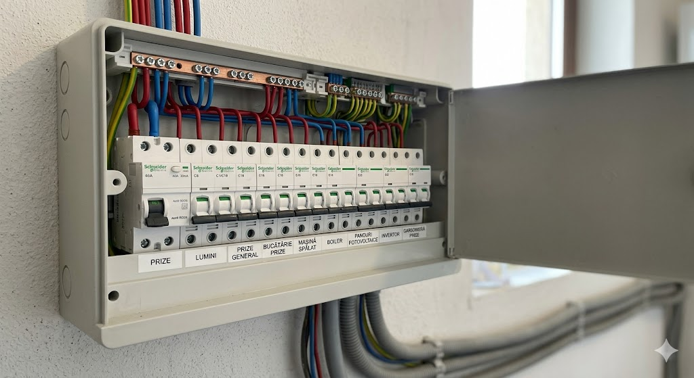
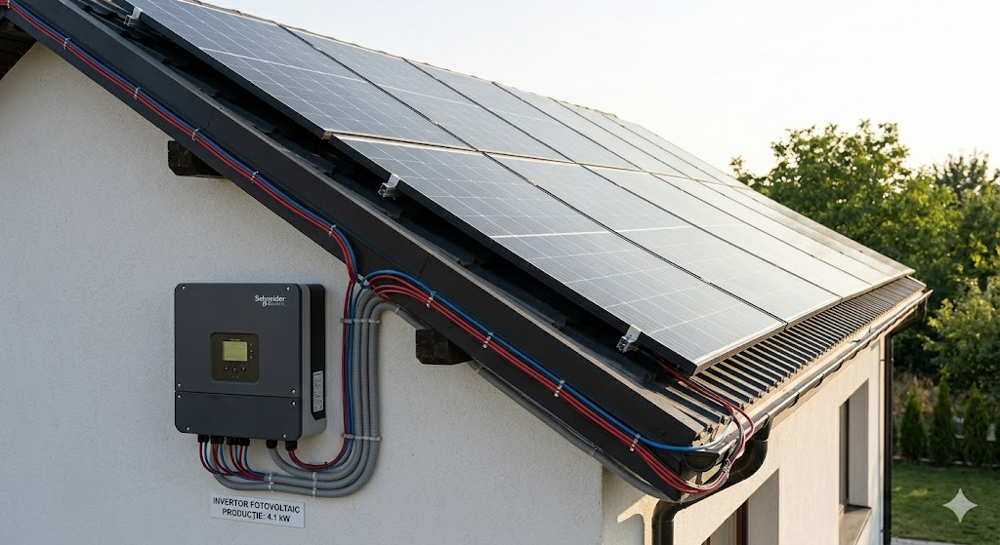

# PFA Alexa Marius - Expertul tău în Energie

Suntem autorizați **ANRE** pentru a oferi soluții complete în domeniul instalațiilor electrice. Siguranța și eficiența energetică a casei tale sunt prioritățile noastre principale.

---

## ⚡ Instalații Electrice de Joasă Tensiune (Apartamente, Case și Vile)

Siguranța locuinței tale începe de la o infrastructură electrică proiectată și executată corect. În calitate de electrician autorizat **ANRE**, ofer servicii complete de proiectare, execuție și mentenanță pentru instalații electrice rezidențiale, respectând cu strictețe normativul **I7/2011**.

### 🛠️ Proiectare și Montaj Tablouri Electrice
Tabloul electric este "inima" casei tale. Nu ne limităm doar la montarea unor siguranțe, ci configurăm un sistem de protecție inteligent:
* **Aparataj Schneider Electric:** Utilizăm exclusiv componente de top pentru o fiabilitate pe termen lung.
* **Protecție Diferențială (RCD):** Indispensabilă pentru prevenirea electrocutării și protejarea vieții membrilor familiei.
* **Protecție la Supratensiune (SPD):** Protejăm echipamentele electronice sensibile (TV, PC, electrocasnice) împotriva fluctuațiilor de tensiune din rețea sau a descărcărilor atmosferice.
* **Echilibrare Fazelor:** Pentru instalațiile trifazate, asigurăm o distribuție optimă a sarcinii pentru a preveni supraîncălzirea conductorilor.

### 🔍 Mentenanță, Diagnostic și Modernizare
O instalație veche reprezintă un risc major de incendiu. Serviciile noastre de mentenanță includ:
* **Verificări Periodice:** Inspectarea contactelor (strângerea bornelor) și testarea pragurilor de declanșare a protecțiilor.
* **Modernizarea Instalațiilor Vechi:** Înlocuirea panourilor cu siguranțe fuzibile (tip vechi) cu tablouri moderne, sigure și estetic integrate.
* **Remedierea Defectelor:** Diagnosticare rapidă pentru circuite întrerupte, scurtcircuite sau consumatori care "sar" siguranțele în mod repetat.

*Calitatea execuției și ordinea în tabloul electric sunt cărțile noastre de vizită.*

---

## ☀️ Panouri Fotovoltaice și Invertoare
Treci la energia verde cu ajutorul sistemelor fotovoltaice performante. Gestionăm întreg procesul de montare și punere în funcțiune.

* **Instalare Panouri:** Montaj pe acoperiș sau structuri solare.
* **Configurare Invertoare:** Optimizarea consumului și stocării energiei.
* **Punere în funcțiune:** Verificarea randamentului sistemului.

*Instalații fotovoltaice eficiente pentru un consum redus și facturi minime.*

---

[Vezi Portofoliul meu]({{ site.baseurl }}/portofoliu) | [Contactează-mă]({{ site.baseurl }}/contact)